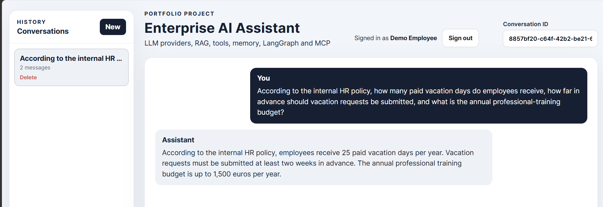
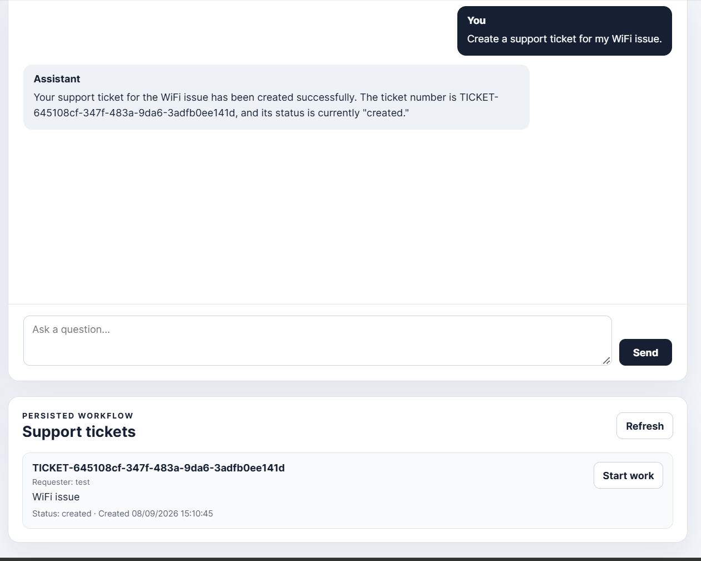

# Enterprise AI Assistant

Enterprise AI Assistant is a production-oriented portfolio reference application for an **Internal Enterprise Operations Assistant**. It demonstrates how authenticated enterprise chat, retrieval-augmented generation (RAG), bounded business tools, multi-provider LLM access, agent orchestration, relational persistence, deterministic AI evaluation, cloud deployment, observability, and release hardening can fit into one coherent system.

The accepted R0-R4 implementation was deployed and live-accepted on Google Cloud. R5 packages that accepted system as the bounded **Portfolio v1.0.0** release; the release tag is created only from a final CI-green `main` commit.

## What the project demonstrates

- FastAPI backend and React/Vite frontend
- JWT authentication with PostgreSQL-backed users and `employee` / `support` authorization
- user-owned PostgreSQL conversations, messages, summaries, and tickets
- OpenAI, Gemini, Ollama, and Mock LLM providers behind an ordered fallback abstraction
- enterprise RAG over TXT/PDF documents
  - ChromaDB for simple local development
  - PostgreSQL/pgvector for the durable cloud path
- LangGraph non-streaming orchestration plus separately characterized streaming orchestration
- bounded calculator and IT-ticket tools guarded by deterministic safe-action policy
- a real MCP Streamable-HTTP ticket capability rather than a simulated tool boundary
- private Cloud Run MCP invocation using Google identity tokens
- versioned prompts and deterministic AI-quality evaluation integrated into CI
- GitHub Actions verification, Docker production images, dependency/security checks, and a synthetic-data repository guard
- GCP deployment with Cloud Run, Cloud SQL, Secret Manager, Artifact Registry, Workload Identity Federation, OpenTelemetry, and Cloud Logging
- bounded release hardening: explicit readiness, CORS/browser headers, process-local rate limits, load smoke, and browser/mobile acceptance

## Product walkthrough

The screenshots below use synthetic demo data.

**Grounded enterprise RAG.** An authenticated employee asks an internal HR-policy question and receives an answer grounded in the indexed enterprise corpus.



**Persisted ticket workflow.** An explicit support-ticket request is confirmed with a public ticket ID and appears in the persisted support workflow with requester, status, and the role-specific action.



## Architecture at a glance

```text
Local
-----
React/Vite
   ↓
FastAPI
   ├── PostgreSQL
   ├── Chroma or pgvector
   └── MCP Streamable HTTP (Compose internal network)

Cloud
-----
Cloud Run frontend (public)
   ↓
Cloud Run backend (public transport + application JWT)
   ├── Cloud SQL PostgreSQL
   │      └── pgvector document chunks
   ├── Secret Manager
   ├── LLM / embedding providers
   └── Google identity token
          ↓
      Cloud Run MCP (private IAM)
          ↓
      Cloud SQL PostgreSQL

Cloud Run migration Job
   └── explicit Alembic migration

backend + MCP
   ├── OpenTelemetry traces → Google Telemetry / Cloud Trace
   └── JSON stdout logs     → Cloud Logging
```

Detailed architecture and operations documentation:

- [`docs/architecture.md`](docs/architecture.md)
- [`docs/architecture-diagrams.md`](docs/architecture-diagrams.md)
- [`docs/deployment-gcp.md`](docs/deployment-gcp.md)
- [`docs/observability.md`](docs/observability.md)
- [`docs/ai-quality.md`](docs/ai-quality.md)
- [`docs/security-baseline.md`](docs/security-baseline.md)
- [`docs/known-limitations.md`](docs/known-limitations.md)

## Quick start

### Prerequisites

- Git
- Docker Desktop / Docker Compose
- Node.js + npm
- no external LLM provider key is required for the basic local smoke path when `LLM_PROVIDER=mock`
- a valid OpenAI API key is required to index/query the bundled RAG corpus because the reference embedding path uses OpenAI; corresponding provider configuration is required if you switch chat away from Mock

### 1. Clone and configure

```bash
git clone https://github.com/hadielz/enterprise-ai-assistant-portfolio.git
cd enterprise-ai-assistant
```

Copy `.env.example` to `.env`. Replace `POSTGRES_PASSWORD`, replace the password embedded in `DATABASE_URL` with the same value, and replace `JWT_SECRET_KEY` with a long random secret. Keep `LLM_PROVIDER=mock` if you want a provider-free local smoke test.

### 2. Build the backend image and start PostgreSQL

```bash
docker compose build backend mcp-server
docker compose up -d postgres
```

### 3. Apply the database migrations

```bash
docker compose run --rm --no-deps --workdir /app/backend backend alembic -c alembic.ini upgrade head
```

Migrations are intentionally explicit rather than being run automatically by application startup.

### 4. Start MCP and the backend

```bash
docker compose up -d mcp-server backend
```

Check the backend:

```text
http://localhost:8000
http://localhost:8000/health
http://localhost:8000/ready
http://localhost:8000/docs
```

### 5. Start the frontend

```bash
cd frontend
npm ci
npm run dev
```

Open the Vite URL shown in the terminal (normally `http://localhost:5173`). The local frontend falls back to `http://localhost:8000/api`; the production image instead receives the backend URL through runtime configuration.

### Optional: enable RAG locally

The bundled knowledge base is under `data/documents/`. RAG indexing currently uses the configured OpenAI embedding path, so set a valid `OPENAI_API_KEY` before indexing.

Local vector storage defaults to:

```text
VECTOR_STORE_BACKEND=chroma
```

To exercise the cloud-compatible vector path locally:

```text
VECTOR_STORE_BACKEND=pgvector
```

The pgvector schema uses 1536-dimensional embeddings for the reference `text-embedding-3-small` path. `POST /api/rag/index` is support-only.

> The commands above are the accepted R5 Quick Start and were re-run successfully from a clean checkout during R5 acceptance.

## Verification

Backend/database suite:

```powershell
.\scripts\test.ps1
```

Deterministic AI quality:

```powershell
docker compose run --rm --no-deps `
    --volume "${PWD}:/app" `
    --workdir /app `
    backend `
    python -m evals.runner
```

The current deterministic inventory contains **41 active required cases** across behavior, RAG, routing, and tool datasets. The accepted R4 baseline passed 41/41, and R5 release-candidate verification passed 41/41 again; the final release commit must remain green in GitHub Actions before `v1.0.0` is created. See [`docs/ai-quality.md`](docs/ai-quality.md).

Release-quality/security checks (these host-side commands require Python 3.11):

```powershell
python -m pip install -r backend/requirements-dev.txt
ruff check backend/app evals tests
pip-audit -r backend/requirements.txt --strict --progress-spinner off --ignore-vuln PYSEC-2026-311 --ignore-vuln PYSEC-2026-3813 --ignore-vuln PYSEC-2026-3814 --ignore-vuln PYSEC-2026-3815
python scripts/security/repository_guard.py
```

The four ChromaDB audit exceptions are reviewed, ID-specific, and documented in [`docs/security-baseline.md`](docs/security-baseline.md). The cloud deployment uses pgvector rather than a Chroma HTTP service.

Frontend:

```powershell
cd frontend
npm ci
npm run lint
npm audit --audit-level=high
npm run build
cd ..
```

Production image builds:

```powershell
docker build -t enterprise-ai-assistant:local .
docker build -t enterprise-ai-frontend:local frontend
```

GitHub Actions runs the backend tests, deterministic AI-quality gate, frontend lint/audit/build, repository/security checks, and both production image builds on pull requests to `main`.

## Security and limitations

The project is a bounded portfolio reference system, not a claim of enterprise-scale completeness. Important security properties include application-level authorization, private cloud MCP invocation, explicit production CORS, bounded process-local rate limiting, Secret Manager injection, synthetic demo data, and repeatable source/dependency checks.

Accepted residuals remain visible rather than being hidden. Examples include process-local rather than distributed rate limiting, access-token-only browser sessions, no document-level RAG ACL model for the synthetic uniform corpus, a shared PostgreSQL application principal across bounded runtime components, and reviewed unresolved local-Chroma advisories.

See:

- [`docs/security-baseline.md`](docs/security-baseline.md)
- [`docs/threat-model.md`](docs/threat-model.md)
- [`docs/known-limitations.md`](docs/known-limitations.md)
- [`docs/hardening-r4.md`](docs/hardening-r4.md)

## Cloud deployment

The accepted R3/R4 reference deployment was validated with public Cloud Run frontend/backend services, a private IAM-protected MCP service, Cloud SQL PostgreSQL/pgvector, Secret Manager, a one-off Alembic migration Job, and OpenTelemetry/structured logging.

Start with:

- [`docs/deployment-gcp.md`](docs/deployment-gcp.md)
- [`docs/observability.md`](docs/observability.md)
- `scripts/gcp/provision-r3.ps1`
- `.github/workflows/deploy-gcp.yml`

The deployment workflow is manual (`workflow_dispatch`) and authenticates GitHub to Google Cloud through Workload Identity Federation rather than a committed long-lived service-account key.

## Release status

```text
R0 — Release Baseline, Product Contract & Scope Freeze       ✅
R1 — Enterprise Authorization & Safe Actions v1              ✅
R2 — Real Ticket Workflow + Real MCP Vertical Slice          ✅
R3 — Cloud + Production Observability v1                     ✅
R4 — Security / Release Hardening                             ✅
R5 — Portfolio v1.0                                          release track
      ↓
   v1.0.0 — release tag
```

R4 is complete. R5 is limited to release documentation/presentation, clean-checkout acceptance, final verification, portfolio media, and release packaging. The `v1.0.0` tag closes v1.0 feature development; subsequent work belongs to post-release tracks.

Release notes are maintained in [`docs/release-notes-v1.0.md`](docs/release-notes-v1.0.md).
