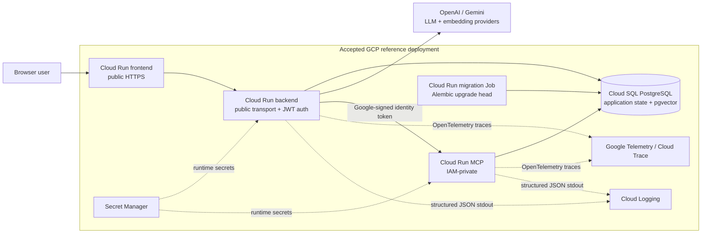
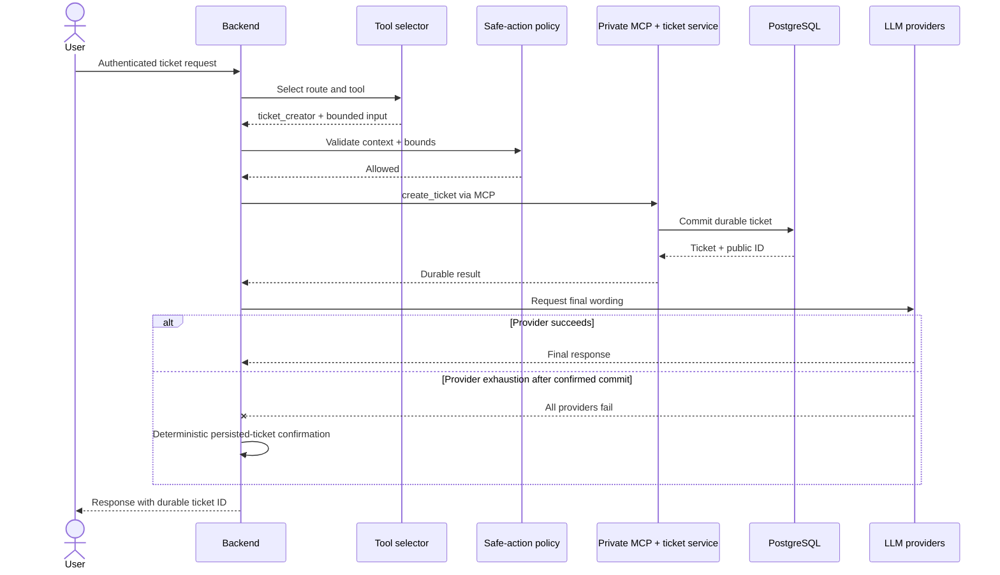
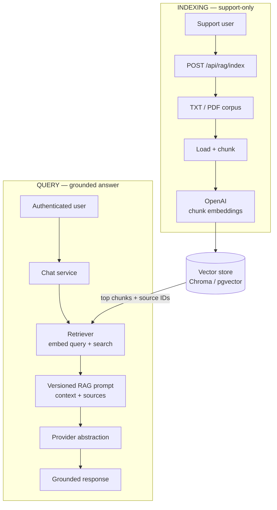
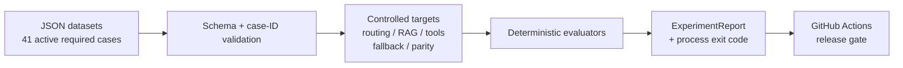

# Architecture Diagrams

These diagrams are the reviewer-facing visual companion to the detailed architecture documents. They summarize the accepted R0-R4 implementation that R5 packages for Portfolio v1.0; they do not introduce new runtime behavior.

## 1. System and cloud architecture

Important boundary: Cloud Run transport to the backend is public because registration/login must be reachable, while application JWT authorization protects authenticated application semantics. The MCP service remains IAM-private.

## 2. Ticket creation and MCP safe-action sequence

For readability, the sequence groups the private MCP server and its internal ticket service/repository into one participant; the implementation still follows the real MCP boundary before durable PostgreSQL persistence. The LLM does not receive unrestricted database authority, and a model-selected business action must pass deterministic application policy.

## 3. RAG indexing and grounded-answer flow

The retriever groups the query-embedding and vector-search steps for readability; both indexing and query-time retrieval use the configured OpenAI embedding path. The local default vector backend is Chroma, while the durable cloud-reference path uses PostgreSQL/pgvector. The synthetic v1.0 corpus is treated as a uniform knowledge domain; document-level ACLs are an explicit non-goal for this release.

## 4. Deterministic AI-quality and CI gate

The diagram groups internal `EvaluationCase`, `TargetResult`, and individual evaluator/reporting types so the release pipeline remains readable at normal GitHub width; [`ai-quality.md`](ai-quality.md) documents those details. The deterministic gate focuses on behavior the application can own and reproduce: routing, tool selection, RAG contracts, provider fallback, prompt identity, and selected streaming/non-streaming parity. It complements pytest and live cloud acceptance; it does not claim deterministic wording from external LLMs.

## Related documentation

- [`architecture.md`](architecture.md) — detailed runtime and cloud architecture
- [`ai-quality.md`](ai-quality.md) — deterministic evaluation design and gate semantics
- [`deployment-gcp.md`](deployment-gcp.md) — accepted GCP deployment/runbook
- [`observability.md`](observability.md) — traces, logging, correlation, and operational view
- [`security-baseline.md`](security-baseline.md) — accepted security controls and residual risks
- [`known-limitations.md`](known-limitations.md) — intentional v1.0 limitations
